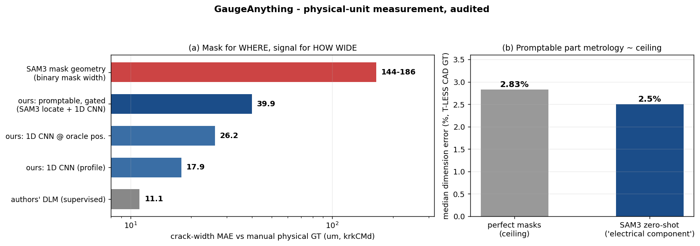
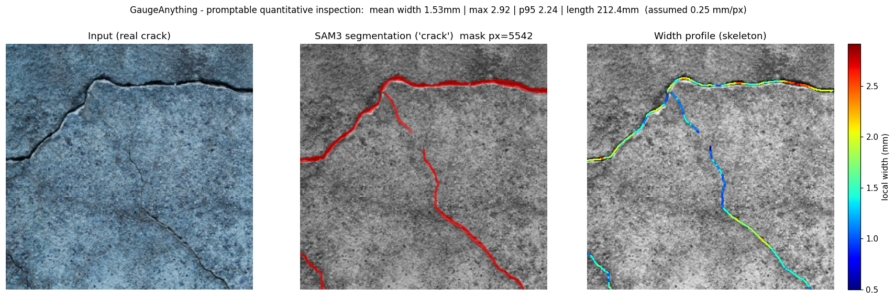

# GaugeAnything

<p align="center">
  <a href="https://falcons-eyes.github.io/GaugeAnything/"></a>
  <a href="https://falcons-eyes.github.io/GaugeAnything/static/pdfs/gaugeanything.pdf"></a>
  <a href="https://huggingface.co/James-joobs/GaugeAnything"></a>
  <a href="LICENSE"></a>
  <a href="https://github.com/falcons-eyes/GaugeAnything/actions/workflows/gaugebench.yml"></a>
</p>

**Promptable quantitative inspection for industrial micro-vision — masks in, millimeters out.**

<p align="center"></p>

Foundation models tell you *what* and *where*. GaugeAnything tells you **how many millimeters,
how many instances, and which condition grade** — the metrology that actually drives field decisions
(crack width, defect size, part spacing), emitted as first-class outputs on top of a promptable
segmentation backbone (SAM 3).

<p align="center">
  
</p>

> Prompt `"crack"` → SAM 3 segmentation → skeleton + EDT width profile → **mean width 1.53 mm**,
> length 212 mm, on a real concrete surface, zero-shot. *(Assumed scale 0.25 mm/px — real-metric
> capture with ArUco markers is the next data milestone; see [Metrology Rigor](#metrology-rigor).)*

🌐 **Project page**: **https://falcons-eyes.github.io/GaugeAnything/** (live) ·
📄 **Paper**: [PDF](https://falcons-eyes.github.io/GaugeAnything/static/pdfs/gaugeanything.pdf) (arXiv pending endorsement) ·
🤗 **Weights**: [James-joobs/GaugeAnything](https://huggingface.co/James-joobs/GaugeAnything) · local: `cd docs && python3 -m http.server 8848`
📄 **Design doc**: [DESIGN.md](DESIGN.md) · **Results log**: [experiments/RESULTS.md](experiments/RESULTS.md) · **Rigor audit**: [docs/RIGOR_AUDIT.md](docs/RIGOR_AUDIT.md)

---

## Why

Every "Anything" model stops at perception: Segment Anything gives masks, Depth Anything gives
relative depth, Count Anything counts. **None emits a measurement.** Industrial inspection needs
"crack width 0.42 mm ± 0.05, condition: Fair" — and as of mid-2026 no foundation model produces
that output. GaugeAnything fills the gap with a metrology core that is honest about its own rigor.

## What's inside

```
gaugeanything/          # the package
├── segmenters.py       #   SAM 3 adapter (+ prompt-set ensemble vs. synonym collapse) + classical fallbacks
├── geometry.py         #   mask → width profile (skeleton+EDT), equivalent diameter, spacing
├── scale.py            #   pixel→mm: ArUco / bolt-head specs / PlaneScale homography (tilt-robust)
├── soft.py             #   soft inspection: illumination-residual (mura), guided matting, Σα measurement
├── router.py           #   regime router: sharp→binary · fuzzy→matting · field→illumination model
├── pipeline.py         #   inspect(): image+prompt → Inspection Atoms {mask, count, mm±σ, grade}
├── selftest.py         #   metrology self-tests (14/14, synthetic GT)
└── soft_selftest.py    #   soft-measurement math self-tests (11/11)
experiments/            # benchmarks & studies (all results reproducible, protocols documented)
docs/                   # project page + rigor audit + per-step progress logs
paper/                  # paper outline (work in progress)
data/                   # dataset acquisition guide + download scripts
```

## Documentation

| Guide | What it covers |
|---|---|
| [**GaugeBench v1.0**](benchmark/README.md) | The promptable physical-measurement benchmark: 5 tracks, fixed splits, pinned numbers, submission guide |
| [**Demo server**](serve/README.md) | FastAPI + Docker inference server (SAM 3 + metrology core) — `/inspect`, `/count_rebar`, live demo UI; RTX 5090 warm latency ~0.2s |
| [Results log](experiments/RESULTS.md) | Every audited number, protocol and verdict, in order |
| [Rigor audit](docs/RIGOR_AUDIT.md) | How we attacked our own results (leakage, metric traps) |
| [Physical coverage matrix](docs/PHYSICAL_COVERAGE_MATRIX.md) | Dataset/quantity coverage across cracks, defects, parts, counts, known objects, dynamic scenes, and next adapters |
| [Owned model roadmap](docs/MODEL_RESEARCH_ROADMAP.md) | GaugeHead/GaugeSpecialist training plan, baseline ladder, and first tiny specialist result |
| [Width bottleneck analysis](docs/WIDTH_BOTTLENECK_ANALYSIS.md) | Physics + method space behind "mask=WHERE, signal=WIDTH" |
| [Dynamic metrology design](docs/DYNAMIC_METROLOGY_DESIGN.md) | TUM/ADT dynamic RGB-D evidence and next uncontrolled-scene experiments |
| [Capture protocol](docs/CAPTURE_PROTOCOL.md) | ArUco+caliper field protocol (printable board included) |
| [Dataset map](paper/DATASETS.md) | All datasets used/found, licenses, traps |
| [Progress log](docs/progress/) | Per-step research records, including failures |

## Quickstart

```bash
git clone https://github.com/falcons-eyes/GaugeAnything.git && cd GaugeAnything
pip install -e .                  # metrology core (CPU)
pip install -e ".[gpu,bench]"     # + SAM 3 backbone & benchmarks

# verify the metrology core (no model weights needed)
python -m gaugeanything.selftest        # 14/14: width ±10%, ArUco scale ±5%, e2e ±15%
python -m gaugeanything.soft_selftest   # 11/11: soft-area / severity / uncertainty math

# measure something (requires SAM 3 access: accept license at hf.co/facebook/sam3, `hf auth login`)
python - <<'PY'
import numpy as np
from PIL import Image
from gaugeanything import inspect
img = np.array(Image.open("your_crack_photo.jpg").convert("RGB"))
res = inspect(img, "crack", segmenter="sam3", marker_size_mm=20.0)  # ArUco 20mm in frame → mm output
print(res.summary())
PY
```

Benchmarks (CrackSeg9k / Magnetic-Tile required — see [data/DATA_ACQUISITION.md](data/DATA_ACQUISITION.md)):

```bash
python experiments/gauge_bench.py --n 150 --segmenters adaptive frangi sam3 --seeds 3
python experiments/gauge_multidomain.py --per 30
python experiments/scale_perspective_eval.py     # CPU-only: tilt error, naive vs homography
```

## Results (audited)

All numbers measured on NVIDIA GB10 (aarch64, CUDA 13.1) with the protocols described in
[docs/RIGOR_AUDIT.md](docs/RIGOR_AUDIT.md) — empty-GT excluded, multi-seed, config selection on
val only, held-out test sources. Deprecated pre-audit numbers are kept in the results log.

**Crack segmentation, zero-shot** (CrackSeg9k, crack-only, 3 seeds):

| Method | crack mIoU (±std) | non-crack clean rate |
|---|---|---|
| frangi (classical) | 0.115 ± 0.005 | 0.26 |
| adaptive (classical) | 0.181 ± 0.006 | 0.00 |
| **SAM 3 zero-shot** | **0.442 ± 0.011** | **0.68** |

2.44× the best classical baseline — and it also wins detection. *(Supervised U-Nets reach ~0.7+
on this benchmark; the claim is promptability, not SOTA.)*

**Segmentation ≠ measurement** — every method under-estimates crack width (GT 11.3 px):

| Method | width MAE (px) ↓ | width rel. err ↓ |
|---|---|---|
| adaptive | 6.67 | **43.5%** |
| **SAM 3** | **5.67** | 62.9% |

Best mIoU is not best measurement — the core motivation for measurement-aware refinement.

**Boundary regimes** — binary segmentation collapses to chance on fuzzy/boundaryless defects
(IoU ≤ 0.03, AUC ≈ 0.50); continuous representations recover signal (val/test protocol):

| Defect | SAM 3 binary | classical soft (test) | learned (test) |
|---|---|---|---|
| Uneven (field) | 0.499 | **0.669** | 0.636 (DRAEM-lite) |
| Fray (fuzzy edge) | 0.526 | 0.644 | — |

**Metrology rigor** — two silent measurement killers, quantified and fixed:

| Failure mode | naive | fixed |
|---|---|---|
| Camera tilt 50° (scale error) | 19.3% | **0.7%** (PlaneScale homography) |
| Prompt synonym collapse ("fracture"/"pit") | mIoU 0.000 | **0.374 / 0.352** (prompt-set ensemble) |

**Dynamic / uncontrolled scenes** — first evidence that the metric signal survives moving cameras:

| Track | Data | Result |
|---|---|---|
| TUM handheld checkerboard | 160 gated frames | **1.06% / 2.60%** median/p90 relative error |
| ADT egocentric walkthroughs | 2 sequences, 480 frames, 229 objects | **8.7%** median 3-D dimension error; **9.1%** in the 0.5m/s+ speed bin |

ADT is an oracle-depth upper bound using GT object volume/pose gates, not SAM3 promptable performance yet.
The ROI-only negative control collapses to **316%** median error, so the next real model problem is replacing
the oracle gate with segmentation or promptable masks.

**Honest negative results** (we publish these too): a matting head that wins 20× on synthetic
fuzzy boundaries **failed to transfer** to real fray (mask IoU 0.48 vs guided filter 0.86) —
synthetic blob distribution ≠ directional texture. Production keeps the classical guided filter;
the learned head ships only after real-distribution synthesis passes. Details:
[docs/progress/](docs/progress/).

## Metrology rigor

This project audits itself before reviewers do ([docs/RIGOR_AUDIT.md](docs/RIGOR_AUDIT.md)):
no test-set tuning (val/test splits), empty-GT separated from IoU, multi-seed reporting,
prompt-sensitivity sweeps, checkpoints saved for every trained artifact, and negative results
documented. Per-step progress logs live in [docs/progress/](docs/progress/).

## Roadmap

- [x] Metrology core (width / diameter / spacing / severity / uncertainty) + self-tests
- [x] SAM 3 integration + classical baselines + cross-source benchmark
- [x] Regime router (sharp / fuzzy / field) + soft measurement
- [x] PlaneScale (tilt-robust mm) + prompt-set ensemble
- [x] Measurement-aware refinement head (M2 v1) — superseded: a 5-number quantile calibration beats it (0.480 vs 0.564 rel. err, held-out); M2 v2 bar = 0.480 + per-source worst-case
- [x] Real-metric substitutes — coins LOO 1.74% real-photo consistency; krkCMd profile-level crack width MAE 27.8±2.5μm (5-fold; single split 25.9) vs manual GT
- [x] Dynamic metric evidence — TUM handheld 1.06% gated error; ADT oracle RGB-D multiview 8.7% over 2 sequences/480 frames/229 objects
- [x] Owned measurement head (M2 v2-a) — GaugeHead-Tiny rel. err **0.472**, first learned rung past the quantile bar (0.480); see [model roadmap](docs/MODEL_RESEARCH_ROADMAP.md)
- [x] Uncertainty audit (M2 v2-b) — 90% conformal intervals keep 0.4724 rel. err with per-source coverage 0.91/1.00/0.95; adaptive variants collapse on the worst source (0.21/0.11) and no difficulty signal flags it (concept shift — honest negative)
- [ ] Real-metric ground truth capture (ArUco/caliper field protocol)
- [ ] Counting & spacing validation (fastener datasets) — next: ROI-1555 density/centroid head (Count v1, target MAE < 5)
- [x] HuggingFace weights release — **https://huggingface.co/James-joobs/GaugeAnything** (task heads + audited model card)
- [x] Paper draft v2 — [PDF on the project page](https://falcons-eyes.github.io/GaugeAnything/static/pdfs/gaugeanything.pdf) (arXiv submission pending endorsement; v2 adds owned-model ladder rung, conformal audit, dynamic-scene section)

## License & third-party

- **Code**: [Apache-2.0](LICENSE).
- **SAM 3 weights**: separate [SAM License](https://github.com/facebookresearch/sam3) (commercial
  use permitted with restrictions) — gated on HuggingFace, not redistributed here.
- **Datasets**: each has its own license (CrackSeg9k CC0; Magnetic-Tile unspecified/research;
  see [data/DATA_ACQUISITION.md](data/DATA_ACQUISITION.md) for the full commercial-use map).
- Trained checkpoints are not in this repo (gitignored); HF release planned.

## Citation

```bibtex
@misc{gaugeanything2026,
  title  = {GaugeAnything: Promptable Quantitative Inspection for Industrial Micro-Vision},
  author = {Joo, Hyunwoo},
  year   = {2026},
  url    = {https://github.com/falcons-eyes/GaugeAnything}
}
```

Part of the **Industrial Anything** research program. Contributions welcome — especially real-world
measurement ground truth (photos with ArUco markers + caliper readings), fastener/counting datasets,
and regime-router edge cases. Open an issue first for anything substantial.
