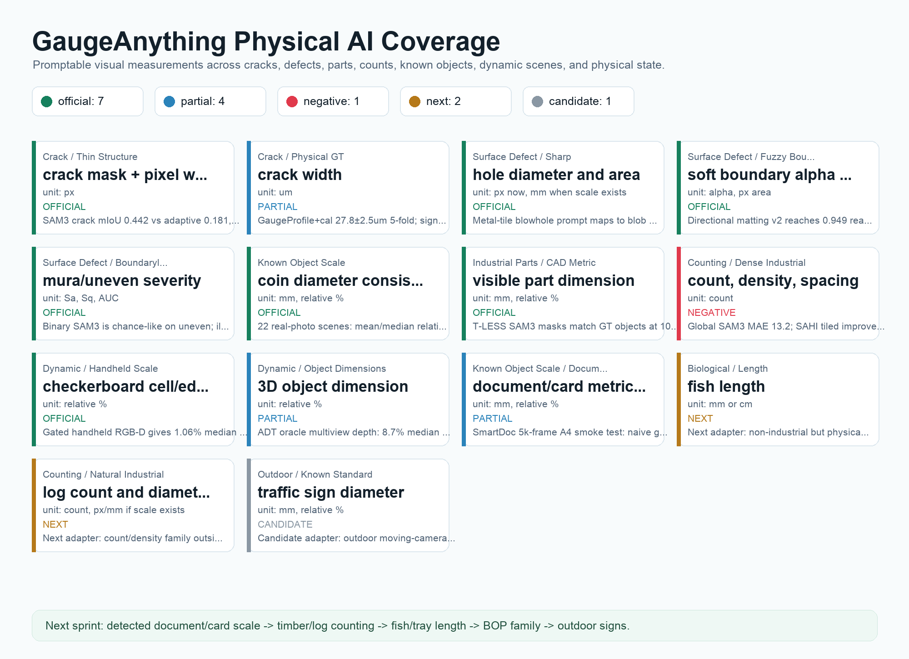

# GaugeAnything — Research Status at a Glance

한 화면 대시보드. 각 트랙의 현재 최고치·baseline·목표·상태. 갱신 2026-06-13.
수치 출처는 GaugeBench release gate에 핀됨([benchmark/](benchmark/README.md)).

## 측정 트랙

| 트랙 | 물리량 | 현재 최고 (ours) | baseline | 상태 |
|---|---|---|---|:--:|
| 크랙 분할 | crack-only IoU | SAM3 zero-shot **0.442** | 고전 0.181 (2.44×) | ✅ |
| 크랙 폭 (px) | rel.err | θ*+quantile **0.437**, GaugeHead-Tiny 0.472 | quantile 0.480 | ✅ |
| 크랙 폭 (물리 μm) | MAE | signal CNN **18.6μm**, e2e 29.8μm | 저자 DLM 11.1 | ✅ |
| 부품 치수 (CAD mm) | rel.err | SAM3 **2.5%** ≈ 완벽마스크 2.83% | — | ✅ |
| known-object 스케일 | rel.err | coins LOO **1.74%** | — | ✅ |
| 문서 스케일 | edge rel.err | detected quad **1.5%** (gate 96%) | naive 10-17% | ✅ p90 tail |
| **카운팅 (rebar)** | MAE | density head **7.0** | SAHI 8.9 | 🟡 dense 미해결 |
| 불확실성 | 90% coverage | conformal **0.91/1.00/0.95** | — | ✅ adaptive 붕괴 |
| 동적 (handheld) | rel.err | TUM gated **1.06%** | — | ✅ |
| 동적 (egocentric) | 3D dim err | ADT oracle **8.7%** | ROI-only 316% | 🟡 oracle gate |

✅ 달성 · 🟡 부분/한계 명시.

## Physical AI Coverage (15 atoms)

| official | partial | next | candidate |
|---:|---:|---:|---:|
| 8 | 4 | 2 | 1 |

전체: [docs/PHYSICAL_COVERAGE_MATRIX.md](docs/PHYSICAL_COVERAGE_MATRIX.md)

## 인프라

| | 상태 |
|---|---|
| 벤치마크 | GaugeBench v1.0 — 5 트랙, 21 핀, CI release gate ✅ |
| 모델 | 9종 학습 완료 ([MODELS.md](MODELS.md)), 8종 HF 배포 |
| 데모 서버 | RTX 5090 Docker, warm ~90ms, CORS ([serve/](serve/README.md)) ✅ |
| 논문 | v2 PDF (owned head·conformal·dynamic·count), arXiv 엔도스먼트 대기 |

## 다음 (로드맵 H1-H3)

상세: [docs/RESEARCH_POSITION_AND_ROADMAP.md](docs/RESEARCH_POSITION_AND_ROADMAP.md)

- **Count v2** — dense crowding(undercount) + sparse floor(overcount) 동시 해결 (multi-scale)
- **ADT seg-gate** — oracle gate를 promptable 마스크로 대체
- **GaugeBench-Field** — ArUco+caliper 실측 mm GT 수집 (분야 첫 공개)
- **GaugeSpecialist-Base** — frozen encoder + 통합 측정 head
