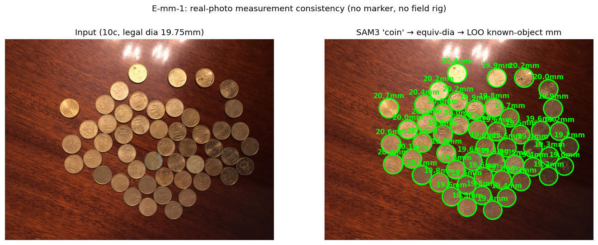
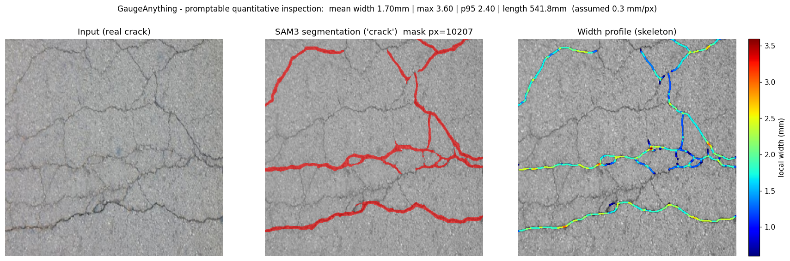
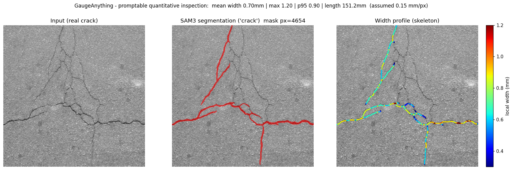
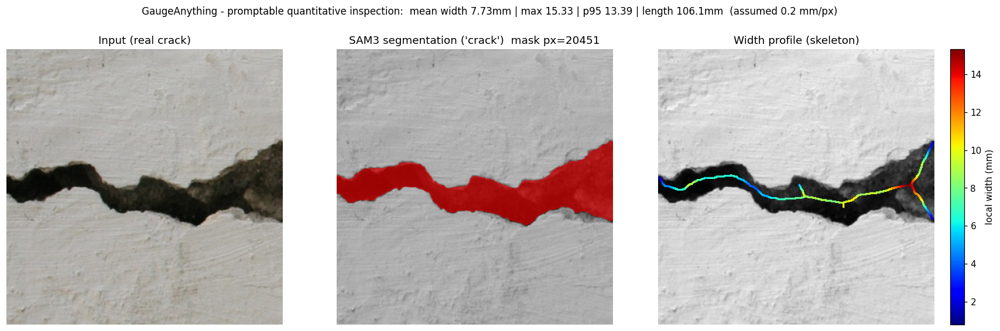
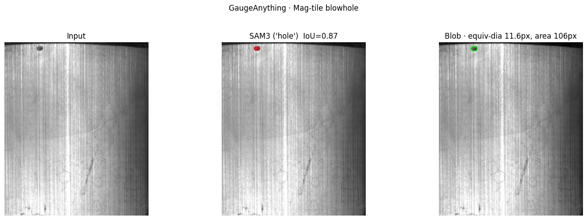
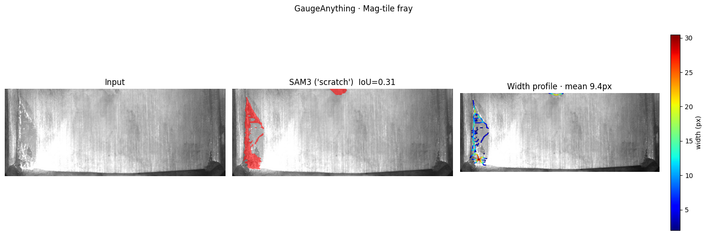
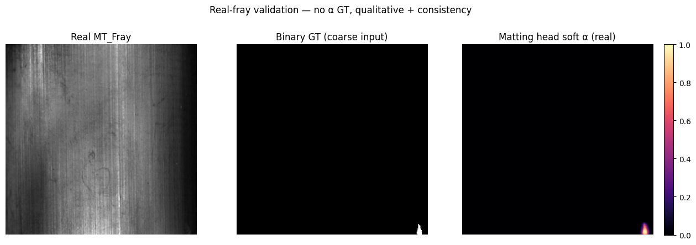
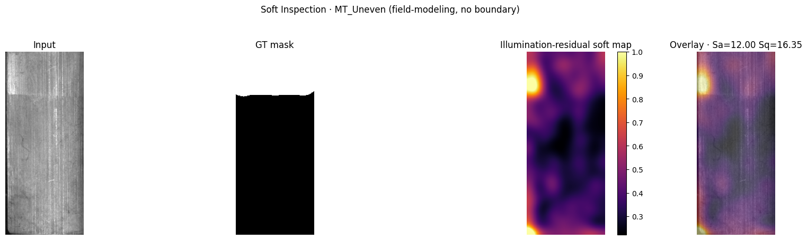
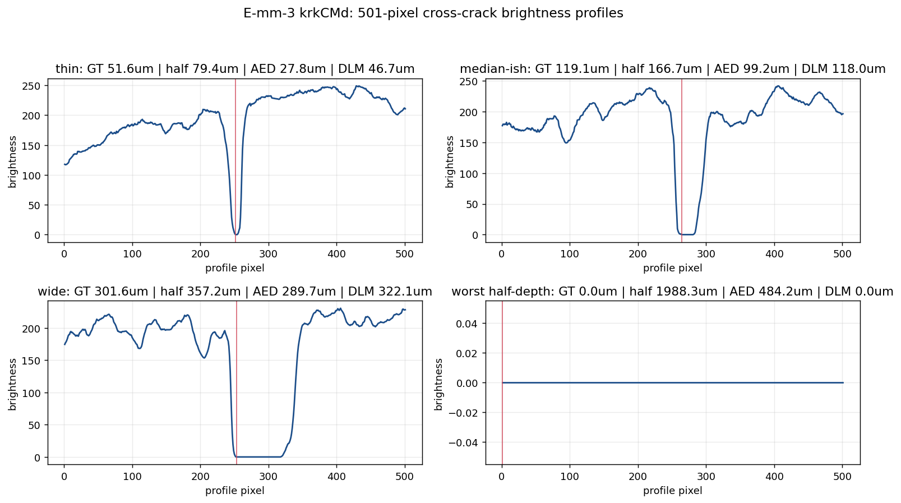
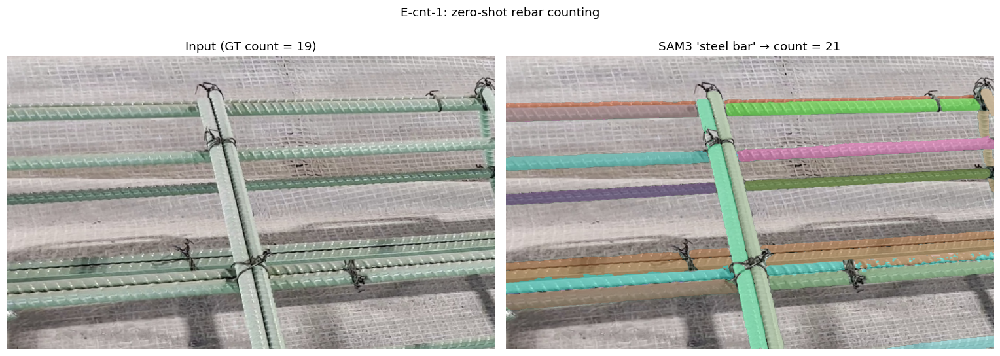

# GaugeAnything EDA Report

Generated: 2026-06-11

This exploratory report consolidates the training/evaluation artifacts from the current GaugeAnything session: audited result JSON files, representative images, model/regime metadata, and the known limits of each result. It is designed to be re-generated with `python experiments/eda_report.py`.

## Executive findings

| Finding | Evidence | Interpretation |
| --- | --- | --- |
| SAM 3 is the best zero-shot crack segmenter | mIoU 0.442 vs adaptive 0.181 (2.45x) | Good backbone choice, but still far from supervised upper bounds. |
| Segmentation quality is not measurement quality | SAM3 width rel.err 62.9%; adaptive 43.5% | GaugeAnything should optimize measurement atoms, not only IoU. |
| M2 refiner helps width without hurting IoU | width rel.err 0.730->0.564 (22.8% relative reduction) | Promising, but bias sign is domain-dependent. |
| Fuzzy/field defects need continuous outputs | SAM3 binary AUC about 0.50; soft methods 0.60-0.67 | Route by visual regime: binary, matting, or field residual. |
| PlaneScale fixes tilt-driven mm error | 50 deg naive 19.290% vs homography 0.710% | Metric claims need local homography scale, not one global px/mm. |
| Known-object real photos validate the diameter chain | coin LOO mean 1.7%, pass@5% 100.0% | This is not a field caliper dataset, but it is real-image mm consistency. |
| krkCMd gives physical crack-width MAE in micrometers | GaugeProfile+cal test MAE 25.9um; author DLM 11.1um | This completes a profile-level physical GT cell; image-level promptable validation remains next. |
| Rebar counting is a confirmed zero-shot failure | global MAE 13.20; SAHI MAE 7.35 | Tiling helps, but touching, low-contrast circular ends still need density or supervision. |
| Prompt synonyms can collapse completely | fracture/pit single prompt mIoU 0.0; ensemble recovers 0.35-0.37 | Prompt-set routing is a required reliability layer. |

## Artifact inventory

### Local files

| Artifact | State | Meaning |
| --- | --- | --- |
| datasets/ | not present in this checkout | raw benchmark images and labels |
| checkpoints/m2_refiner.pt | not present in this checkout | measurement-aware refiner weights |
| checkpoints/matte_fray_directional.pt | not present in this checkout | directional matting v2 weights |
| checkpoints/draem_uneven.pt | not present in this checkout | field-regime DRAEM-lite weights |
| docs/assets/ | present | checked-in visual evidence |
| datasets/coins | not present in this checkout | known-object real-photo mm substitute |
| datasets/rebar_roi1555 | not present in this checkout | rebar instance-count GT |
| datasets/tless | not present in this checkout | CAD+pose metric object candidate |
| datasets/krkcmd | not present in this checkout | crack-width real-mm candidate |

### Result JSON inputs

| File | Size |
| --- | --- |
| audit_baselines.json | 0.9 KB |
| coins_mm_eval.json | 3.1 KB |
| draem_uneven.json | 0.1 KB |
| gauge_bench.json | 1.6 KB |
| gauge_bench_measure.json | 0.7 KB |
| gauge_multidomain.json | 1.1 KB |
| krkcmd_profile_eval.json | 7.6 KB |
| krkcmd_split_audit.json | 23.9 KB |
| m2_refiner.json | 1.1 KB |
| matte_fray.json | 0.4 KB |
| prompt_ensemble.json | 0.3 KB |
| prompt_sweep.json | 0.7 KB |
| rebar_count_eval.json | 7.7 KB |
| rebar_sahi_eval.json | 2.3 KB |
| scale_perspective.json | 1.0 KB |
| soft_inspection.json | 0.3 KB |
| uneven_protocol.json | 0.3 KB |

## Visual case gallery

These are the checked-in visual artifacts used as qualitative anchors for the EDA.

| Regime | Image | What to inspect |
| --- | --- | --- |
| End-to-end gauge demo |  | Mask-to-width/length atoms on a real concrete surface. |
| Real-metric substitute |  | Known-object leave-one-out mm consistency with many instances. |
| Crack source: CFD |  | Concrete crack morphology and SAM3 thin-structure behavior. |
| Crack source: CrackTree200 |  | Hard thin-crack source where per-source IoU is weak. |
| Crack source: DeepCrack |  | Held-out source used by M2 reporting. |
| Magnetic tile: blowhole |  | Blob-like defect where diameter is the natural measurement. |
| Magnetic tile: fray |  | Fuzzy boundary regime: binary masks become brittle. |
| Matting v2 |  | Directional matting transfer evidence on real fray. |
| Field uneven |  | Boundaryless field anomaly where residual maps beat binary segmentation. |
| krkCMd profiles |  | Physical crack-width GT in micrometers over 501-pixel profiles. |
| Rebar counting |  | Instance-count behavior on dense touching bars. |

## Experiment 1: zero-shot crack segmentation

**Data/labels.** CrackSeg9k, crack-only masks; empty-GT images are excluded from crack mIoU and reported separately as non-crack clean rate.

| Model | Type | mIoU | std | non-crack clean | sec/img |
| --- | --- | --- | --- | --- | --- |
| SAM3 | foundation model | 0.442 | 0.011 | 67.9% | 0.363 |
| adaptive | classical threshold | 0.181 | 0.005 | 0.0% | 0.003 |
| frangi | classical vesselness | 0.115 | 0.005 | 25.8% | 0.089 |

**EDA read.** SAM3 wins both segmentation and false-positive avoidance, but the per-source spread shows thin-crack brittleness. This is the empirical reason for keeping SAM3 as the backbone while adding measurement-aware heads and calibration.

## Experiment 2: measurement fidelity

**Data/labels.** Same crack masks, but the target is geometry derived from GT masks: width, length, and skeleton/EDT statistics. This is not real-mm ground truth.

| Method | mIoU | width MAE | width rel.err | GT->pred width |
| --- | --- | --- | --- | --- |
| adaptive | 0.188 | 6.669 | 43.5% | 11.300->4.990 px |
| frangi | 0.109 | 8.873 | 61.6% | 11.300->2.440 px |
| sam3 | 0.431 | 5.670 | 62.9% | 11.300->8.820 px |

**EDA read.** SAM3 has the best mIoU and absolute width MAE, but adaptive has the best relative width error. This mismatch is the strongest evidence that an inspection model needs metric atoms and calibration, not a mask score alone.

## Experiment 3: M2 measurement-aware refiner

**Model.** A small refiner over frozen SAM3 masks and image features. **Training/evaluation split.** Source-held-out test: CFD, CrackTree200, DeepCrack.

| Scope | Raw mIoU | Refined mIoU | Raw width err | Refined width err | Raw bias | Refined bias |
| --- | --- | --- | --- | --- | --- | --- |
| overall | 0.482 | 0.487 | 0.730 | 0.564 | 0.680 | 0.503 |
| cfd | 0.404 | 0.416 | 0.993 | 0.775 | 0.912 | 0.695 |
| cracktree200 | 0.014 | 0.018 | 1.081 | 0.626 | 1.081 | 0.626 |
| deepcrack | 0.648 | 0.647 | 0.401 | 0.341 | 0.371 | 0.288 |

**EDA read.** The refiner reduces held-out width error by roughly 23% relative while preserving mIoU. The caution is structural: bias direction differs by source, so M2 v2 should be domain- or scale-conditioned.

## Experiment 4: multi-domain defect behavior

| Domain | n | mIoU | shape tags | mean width px | mean diameter px |
| --- | --- | --- | --- | --- | --- |
| crack_concrete | 25 | 0.367 | {'thin': 22} | 8.000 | - |
| mt_blowhole | 30 | 0.429 | {'blob': 18} | - | 11.600 |
| mt_crack | 30 | 0.454 | {'thin': 23, 'blob': 2} | 3.900 | 16.800 |
| mt_break | 30 | 0.030 | {'thin': 7, 'blob': 1} | 4.800 | 35.200 |
| mt_fray | 30 | 0.025 | {'thin': 20, 'blob': 3} | 5.100 | 24.900 |
| mt_uneven | 28 | 0.005 | {'blob': 11, 'thin': 10} | 8.000 | 18.000 |

**EDA read.** Concrete cracks, metal cracks, and blowholes transfer reasonably because they map to concrete visual nouns and stable measurement primitives. Fray, break, and uneven collapse because their labels are textural or boundaryless anomalies.

## Experiment 5: soft inspection and learned fuzzy/field heads

| Defect | n | SAM3 binary AUC | residual AUC | raw gray AUC | Sa | Sq |
| --- | --- | --- | --- | --- | --- | --- |
| Uneven | 25 | 0.498 | 0.683 | 0.563 | 11.553 | 16.181 |
| Fray | 25 | 0.526 | 0.605 | 0.563 | 10.847 | 15.496 |

| Field model | val | test | Selected config |
| --- | --- | --- | --- |
| classical residual | 0.664 | 0.669 | {'detrend': True, 'smooth': 9.0} |
| DRAEM-lite | 0.606 | 0.636 | {'ensemble': True} |

| Matting metric | Value |
| --- | --- |
| synthetic alpha MAE, directional matting | 0.0056 |
| synthetic alpha MAE, binary | 0.0083 |
| real fray IoU at alpha>=0.5 | 0.949 |
| guided matte IoU | 0.860 |
| boundary softness | 0.590 |

**EDA read.** Soft maps recover signal where binary masks are near random. The directional matting v2 result is the important reversal: learned matting now beats the classical guided matte on real fray preservation, while alpha accuracy remains synthetic-only because real alpha GT is unavailable.

## Experiment 6: prompts, confidence, and metadata

| Domain | n | mean | best | spread | per-prompt mIoU |
| --- | --- | --- | --- | --- | --- |
| concrete_crack | 60 | 0.284 | 0.387 | 0.387 | {'crack': 0.3861, 'cracks': 0.387, 'fracture': 0.0, 'thin dark crack': 0.3625} |
| mt_crack | 57 | 0.405 | 0.448 | 0.069 | {'crack': 0.4482, 'cracks': 0.4034, 'scratch': 0.3905, 'dark line': 0.3791} |
| mt_blowhole | 59 | 0.252 | 0.396 | 0.396 | {'hole': 0.3957, 'pit': 0.0, 'blowhole': 0.2299, 'small dark spot': 0.3827} |

| Ensemble case | broken prompt | single broken | single best | ensemble via broken |
| --- | --- | --- | --- | --- |
| concrete_crack | fracture | 0.000 | 0.367 | 0.374 |
| mt_blowhole | pit | 0.000 | 0.398 | 0.351 |

**Metadata availability.** Learned heads can expose logits directly because they are local PyTorch modules. SAM3 metadata depends on the HuggingFace `Sam3Processor`/`Sam3Model` return schema; `experiments/eda_probe.py` probes tensor attributes, post-processed masks, scores, and low-threshold candidate-score spectra before any confidence-heavy analysis.

## Experiment 7: scale, mm rigor, and real-metric substitutes

| Tilt | detected | naive mm | naive err | homography mm | homography err |
| --- | --- | --- | --- | --- | --- |
| 0 | True | 60.380 | 0.630% | 60.380 | 0.630% |
| 10 | True | 60.540 | 0.900% | 57.600 | 3.990% |
| 20 | True | 61.640 | 2.730% | 60.250 | 0.410% |
| 30 | True | 63.860 | 6.430% | 60.580 | 0.960% |
| 40 | True | 67.310 | 12.190% | 60.450 | 0.740% |
| 50 | True | 71.570 | 19.290% | 60.420 | 0.710% |

**EDA read.** The scale failure is geometric, not model-specific. A single marker-derived px/mm can be nearly 20% wrong under tilt; local PlaneScale homography brings the 50-degree case below 1% error.

**Real-metric substitute note.** The coin leave-one-out result from the progress log reports 22 images with 8-60 coins/image, mean relative error 1.74%, median 1.68%, and 100% pass at ±5%/±10%. This validates the segmentation-to-diameter chain on real photos, even though it is known-object consistency rather than an industrial caliper dataset.

### E-mm-1: coin known-object consistency

| Metric | Value |
| --- | --- |
| images | 22 |
| mean relative error | 1.7% |
| median relative error | 1.7% |
| mean px coefficient of variation | 2.1% |
| pass@5% | 100.0% |
| pass@10% | 100.0% |
| scope note | LOO 일관성 검증 — 분할+직경 체인. 절대 마커 체인은 합성 0.38% 별도 |

| Worst scene | denom | n coins | rel.err | px CV |
| --- | --- | --- | --- | --- |
| IMG_4195.JPG | 2e | 8 | 3.0% | 3.2% |
| IMG_4188.JPG | 20c | 45 | 2.8% | 3.4% |
| IMG_4194.JPG | 2e | 8 | 2.6% | 2.7% |
| IMG_4201.JPG | 50c | 25 | 2.2% | 2.7% |
| IMG_4191.JPG | 10c | 50 | 2.2% | 3.6% |
| IMG_4196.JPG | 2e | 8 | 2.1% | 2.1% |
| IMG_4192.JPG | 10c | 50 | 2.1% | 3.5% |
| IMG_4210.JPG | 20c | 46 | 2.1% | 2.5% |

**EDA read.** The worst image is still below 3% relative error, and all scenes pass ±5%. The failure surface is not count density itself: several 45-60 coin scenes remain stable. The metric caveat is that this is same-denomination leave-one-out consistency, not an independent absolute-scale marker measurement.

### E-mm-3: krkCMd physical crack-width profiles

| Meta | Value |
| --- | --- |
| profiles | 19098 |
| groups | 36 |
| train/test profiles | 14424 / 4674 |
| unit | um |
| px_to_um | 3.96875 |
| GT | MANwidth |
| scope | profile-level physical-width benchmark; full image zip not required |

| Method | test MAE | test RMSE | test medAE | pass@50um | r |
| --- | --- | --- | --- | --- | --- |
| DLMwidth(author) | 11.1um | 22.9um | 5.5um | 96.5% | 0.9728 |
| GaugeProfile-minrun5+linear-cal | 25.9um | 50.6um | 16.0um | 84.6% | 0.8638 |
| AEDwidth(author) | 26.5um | 40.0um | 23.8um | 91.3% | 0.9299 |
| GaugeProfile-minrun5 | 31.3um | 50.1um | 23.8um | 88.6% | 0.8638 |
| GaugeProfile-halfdepth+linear-cal | 55.2um | 83.3um | 41.9um | 62.9% | 0.6301 |

**EDA read.** The author DLM is the strong specialized anchor at 11.1um MAE. A deterministic GaugeProfile valley rule with group-split linear calibration reaches 25.9um MAE, essentially matching the author AED baseline on this split. This is a profile-level physical GT result, not yet a full image prompt-to-mask measurement.

### E-cnt-1: rebar counting

| Prompt | n | GT mean | MAE | mean rel.err | acc@10% | exact |
| --- | --- | --- | --- | --- | --- | --- |
| metal rod | 20 | 20.2 | 13.200 | 80.2% | 0.0% | 0.0% |
| circular cross section | 20 | 20.2 | 20.250 | 100.0% | 0.0% | 0.0% |
| rebar end | 20 | 20.2 | 20.150 | 99.7% | 0.0% | 0.0% |
| pipe | 20 | 20.2 | 18.100 | 91.0% | 0.0% | 0.0% |

| Worst rows for best prompt 'metal rod' | GT | pred | abs err |
| --- | --- | --- | --- |
| 000000001255.jpg | 81 | 10 | 71 |
| 000000001563.jpg | 61 | 18 | 43 |
| 000000001337.jpg | 48 | 18 | 30 |
| 000000001468.jpg | 33 | 12 | 21 |
| 000000001493.jpg | 30 | 14 | 16 |
| 000000001072.jpg | 20 | 8 | 12 |
| 000000001477.jpg | 16 | 7 | 9 |
| 000000001495.jpg | 22 | 13 | 9 |

**EDA read.** Prompt wording does not rescue the task: all prompts have 0% acc@10%. The best prompt undercounts dense scenes sharply and can overcount sparse scenes, consistent with a visual-domain failure on touching, rusty, low-contrast bar ends rather than a pure language mismatch.

### E-cnt-2: SAHI-style tiled rebar counting

| Method | n | MAE | mean rel.err | acc@10% | exact | pred mean |
| --- | --- | --- | --- | --- | --- | --- |
| Global SAM3 'metal rod' | 20 | 13.200 | 80.2% | 0.0% | 0.0% | - |
| SAHI SAM3 tiled | 20 | 7.350 | 52.9% | 20.0% | 5.0% | 15.0 |

| Worst SAHI rows | GT | pred | abs err |
| --- | --- | --- | --- |
| 000000001255.jpg | 81 | 40 | 41 |
| 000000001563.jpg | 61 | 30 | 31 |
| 000000001337.jpg | 48 | 28 | 20 |
| 000000001468.jpg | 33 | 20 | 13 |
| 000000001493.jpg | 30 | 24 | 6 |
| 000000000597.jpg | 11 | 6 | 5 |

**EDA read.** Tiling materially improves MAE (13.2 to 7.35) and creates nonzero acc@10%, so the global failure is partly a scale/crowding problem. It does not solve dense touching counts: the largest piles are still undercounted by 20-40 bars, pointing to density/centroid supervision.

## Limits and next EDA passes

| Limit | Why it matters | Next action |
| --- | --- | --- |
| Raw dataset panel depth | Raw datasets are not present in this checkout, so only checked-in aggregate artifacts are used. | Extend the generator with per-sample exports for the most useful failure clusters. |
| SAM3 logits not assumed stable | Processor/model schemas can change. | Use `eda_probe.py` to record available fields before relying on confidence curves. |
| Real alpha GT missing | Fray alpha accuracy is synthetic-only. | Collect or synthesize calibrated translucent/fuzzy boundary targets. |
| Mask-derived width GT | M2 evaluates measurement consistency, not physical crack width. | Proceed with krkCMd/T-LESS/ArUco real-mm tracks. |
| Counting zero-shot gap | Rebar result shows SAM3 concept limits on touching low-contrast instances. | Evaluate SAHI tiling, density fallback, or small supervised head. |

